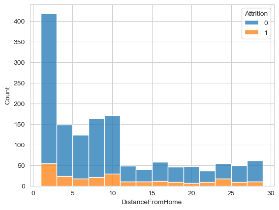

# Attrition in IBM


En este proyecto, se realizó un análisis del dataset de la empresa IBM para determinar si hay alguna relación entre la tasa de Attrition y diferentes variables. El análisis se llevó a cabo utilizando el lenguaje de programación Python y la librería Pandas.
A continuación, se proporciona una descripción más detallada de los objetivos y resultados del proyecto, así como de las herramientas y técnicas utilizadas.

# DATOS

El conjunto de datos utilizado en este proyecto es el conjunto de datos de Attrition en empleados de la empresa IBM, disponible en Kaggle. El conjunto de datos está en formato CSV.

Para cargar el conjunto de datos en un DataFrame de Pandas, puedes utilizar la siguiente línea de código:

```
python
df = pd.read_csv('pd.read_csv(r'HR-Employee-Attrition.csv')
```

# Requisitos

Para ejecutar este Jupyter Notebook, necesitarás tener instalados los siguientes paquetes de Python:

NumPy (puedes instalarlo ejecutando pip install numpy en tu terminal)
Pandas (puedes instalarlo ejecutando pip install pandas en tu terminal)
Seaborn (puedes instalarlo ejecutando pip install seaborn en tu terminal)
Matplotlib (puedes instalarlo ejecutando pip install matplotlib en tu terminal)
Además, deberás tener instalado Jupyter Notebook para ejecutar el archivo de notebook. Puedes instalarlo ejecutando pip install jupyter en tu terminal.

Una vez que hayas instalado estas dependencias, deberías poder ejecutar el Jupyter Notebook sin problemas.

# Exploración del Attrition

Para comenzar el análisis, se ha visualizado la tasa de Attrition en el conjunto de datos utilizando un countplot y un pieplot. Esto se logró utilizando la biblioteca de visualización de datos Seaborn en Python:

``python

pal = sns.color_palette("GnBu",n_colors=2)

def count_Plot(feature, data,xl,yl,axs,hu=None):
    ax = sns.countplot(x=feature,palette=pal, data=data,hue=hu,ax=axs)
    for p in ax.patches:
        ax.annotate(f'\n{p.get_height()}',(p.get_x()+0.2,p.get_height()),  ha='center', va='center', size=18)
    axs.set(xlabel=xl, ylabel=yl)

def pie_plot(feature,data,xl,axs):
    co = data[feature].value_counts(normalize=True)
    labels = ['Employee Stay','Employee Quit']
    
    axs.pie(co, labels = labels, colors=pal,autopct='%.0f%%')
    axs.set(xlabel=xl)
``


Este gráfico nos muestra que el conjunto de datos está desequilibrado, con más empleados que no han abandonado (84%) la empresa que empleados que han abandonado (16%)

A partir de aquí, se han investigado como hipotesis posibles variables que podrían afectar la tasa de Attrition y se ha examinado la relación entre Attrition y Salario, Género y Distancia al Trabajo.

También quise ver la distribución de la edad:


Es una distribución típica es una distribución simétrica que se asemeja a una campana, y que la media de la distribución está en el centro de la campana.

# Relación de Attrition con otras variables (visualización)

Attrition y Años con el mismo manager

``
pyton

Attrition
No     4.367397
Yes    2.852321
``


Attrition y Años desde la última promoción

``
python

Attrition
No     2.234388
Yes    1.945148
``


Attrtion y Años en el mismo rol

``
python

Attrition
No     4.484185
Yes    2.902954
``


# Hipotesis del proyecto

Hipótesis 1: Los empleados que menos cobran tienen más probabilidades de dejar la empresa.
Hipótesis 2: Los empleados que viven más lejos tienen más probabilidades de dejar la empresa que los empleados viven cerca.

# Hipótesis 1: Los empleados que menos cobran tienen más probabilidades de dejar la empresa.

Para analizar la relación entre el Salario y la tasa de Attrition, se ha visualizado la media de salario de los empleados que se van de la empresa y la media de los empleados que no lo hacen.

Esto se logró utilizando un barplot y un displot:

-Media
Attrition
0    24375.133820
1    22510.886076

````
python

sns.barplot(x='Attrition', y='MonthlyIncome', data=df)

plt.title('Left vs Remain')
plt.xlabel('Attrition')
plt.ylabel('Monthly Salary')

plt.show()
````


Para confirmar si la diferencia en la media de salario entre los empleados que se van de la empresa y los que no lo hacen es estadísticamente significativa, se ha utilizado la prueba t de Student.

La prueba t de Student es una prueba estadística que se utiliza para comparar la media de dos grupos. En este caso, se han comparado las medias de salario de los empleados que abandonan la empresa y los empleados que permanecen en ella.

Se ha utilizado la función ttest_ind de la biblioteca de análisis de datos de Python, Pandas, para realizar la prueba t de Student:

````
python

left = df_attrition[df_attrition['Attrition']==1]['MonthlyIncome']
remain = df_attrition[df_attrition['Attrition']==0]['MonthlyIncome']

media_left = np.mean(left)
std_left = np.std(left)

media_remain = np.mean(remain)
std_remain = np.std(remain)

from scipy.stats import ttest_ind

t, p = ttest_ind(left, remain, equal_var=True)

print("Valor t:", t)
print("Valor p:", p)
`````

Valor t: -2.1740836777017747
Valor p: 0.02985816066026497

El valor p de la prueba t fue de 0.02, menor que el nivel de significancia establecido de 0.05, lo que sugiere que la diferencia en las medias de salario es estadísticamente significativa. 

Aunque la prueba t de Student proporciona evidencia estadística de una diferencia significativa en las medias de salario, se deben considerar otros factores relevantes para confirmar la hipótesis. Esto puede incluir la realización de análisis adicionales como una analisis de regresión (relación lineal) y un analisis de correlación, por ejemplo, y la interpretación cuidadosa de los resultados en el contexto del problema en cuestión.


# Hipótesis 2: Los empleados que viven más lejos tienen más probabilidades de dejar la empresa que los empleados viven cerca.

A nivel de visualización, hice un countplot para ver como se distribuia la distancia del trabajo a casa dentro de la empresa:


Primero miramos la correlación entre las dos variables - distancia y attrition:

```
corr_Distance_Attrition = df['DistanceFromHome'].corr(df['Attrition'])
corr_Distance_Attrition
````
0.08

Después utilice un boxplot y un histplot para ver esta relación de variables:





Para ver si habia diferencias significativas, volví a utilizar de nuevo la T de Student como en el anterior hipotesis:
````
group_0 = df[df['Attrition'] == 0]['DistanceFromHome']
group_1 = df[df['Attrition'] == 1]['DistanceFromHome']

t_statistic, p_value = ttest_ind(group_0, group_1)

print("t-Statistic: ", t_statistic)
print("p-value: ", p_value)
````

t-Statistic:  -2.994708098265125
p-value:  0.0027930600802134266

La prueba t de Student proporciona evidencia estadística de una diferencia significativa en la relación entre la distancia a casa y el attrition, es importante tener en cuenta otros factores que pueden influir en esta relación. 
Esto, como hemos dicho anteriormente, podría incluir realizar análisis adicionales y considerar el contexto y las condiciones específicas del problema en cuestión.


# Conclusiones

En este proyecto, se ha analizado el dataset de la empresa IBM para determinar si existe alguna relación entre la tasa de Attrition y las variables como Salario y Distancia al Trabajo. El análisis se realizó utilizando el lenguaje de programación Python y la librería Pandas.

En primer lugar, se ha visualizado la tasa de Attrition en el conjunto de datos mediante un countplot y un pieplot, lo que mostró que el conjunto de datos está desequilibrado, con más empleados que no han abandonado (84%) la empresa que empleados que han abandonado (16%).

A continuación, se han investigado hipótesis posibles variables que podrían afectar la tasa de Attrition y se ha examinado la relación entre Attrition y Salario y Distancia al Trabajo. Se ha explorado la distribución de la edad, que sigue una distribución típica simétrica que se asemeja a una campana, y se ha examinado la relación entre Attrition y otras variables como Años con el mismo manager, Años desde la última promoción y Años en el mismo rol.

Para validar las hipótesis planteadas, se ha analizado la relación entre la tasa de Attrition y el Salario. Se ha visualizado la media de salario de los empleados que se van de la empresa y la media de los empleados que no lo hacen utilizando un barplot y un displot, lo que ha mostrado que los empleados que menos cobran tienen más probabilidades de dejar la empresa. Además, se ha utilizado el testt de T de Student para confirmar que la diferencia en la media de salario entre los empleados que se van de la empresa y los que no lo hacen es estadísticamente significativa.

En cuanto a la relación entre Attrition y la distancia al trabajo, se ha visualizado la relación entre la tasa de Attrition y la distancia al trabajo utilizando un boxplot y un displot, lo que ha mostrado que los empleados que viven más lejos tienen más probabilidades de dejar la empresa que los empleados que viven cerca.

En conclusión, los resultados obtenidos en este proyecto sugieren que el salario y la distancia al trabajo son variables importantes que afectan la tasa de Attrition en la empresa IBM. Los empleados con salarios más bajos y los que viven más lejos tienen más probabilidades de dejar la empresa. Es importante para las empresas comprender los factores que influyen en la tasa de Attrition para retener a sus empleados y reducir los costos asociados con la rotación de personal.


# Futuras mejoras del proyecto

1- Incluir más variables: el análisis podría mejorarse incluyendo más variables que podrían estar relacionadas con la tasa de Attrition, como la satisfacción laboral, la carga de trabajo, el tiempo de trayectoria en la empresa, entre otros. Al incluir más variables, se pueden encontrar patrones más complejos y aumentar la precisión del modelo predictivo.

2 - Utilizar técnicas predictivas: en lugar de limitarse a visualizar las relaciones entre las variables y la tasa de Attrition, se pueden utilizar técnicas de aprendizaje automático para crear un modelo predictivo que pueda predecir la tasa de Attrition en función de las variables de entrada. Estos modelos pueden ser más precisos que los modelos basados en la intuición humana y las visualizaciones.

3 - Comparar el dataset con otros datasets de la industria: para tener una mejor comprensión de los factores que influyen en la tasa de Attrition en la industria, se podría comparar el dataset de IBM con otros datasets de empresas similares. Esto permitiría identificar patrones y tendencias en la industria y mejorar la precisión del análisis.

4 - Realizar un análisis temporal: el análisis podría mejorarse incluyendo un análisis temporal para evaluar cómo cambia la tasa de Attrition con el tiempo y si hay alguna tendencia a largo plazo en la empresa. Esto podría ayudar a identificar cambios en la cultura de la empresa o factores externos que puedan estar influyendo en la tasa de Attrition.


